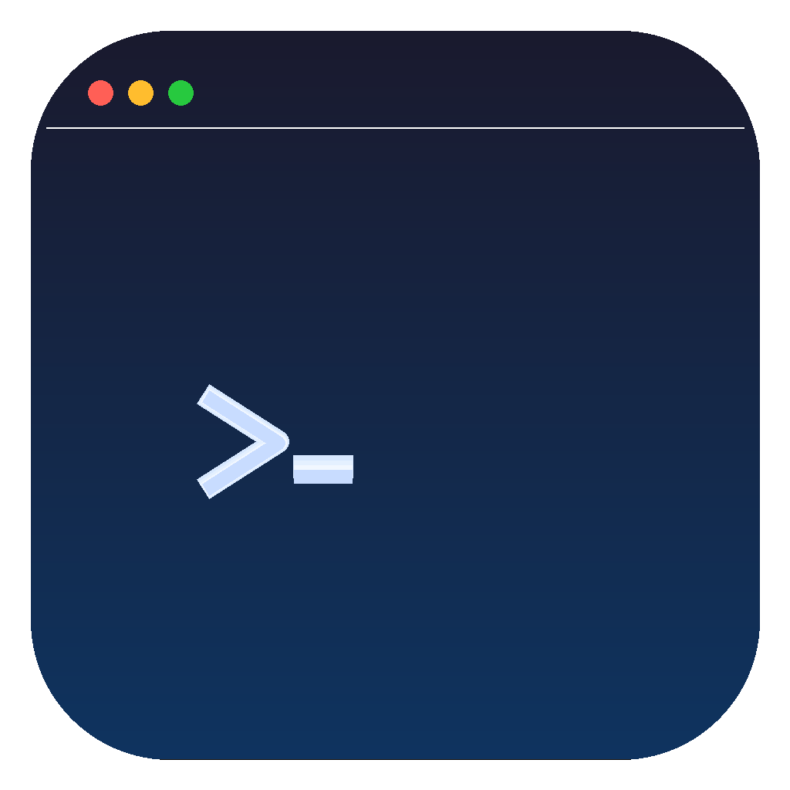

<p align="center">
  
</p>

<h1 align="center">Claudoscope (Personal Fork)</h1>

<p align="center">
  A native macOS menu bar app for exploring, analyzing, and managing your Claude Code sessions.
</p>

> **This is a personal fork** maintained for private use. The auto-update mechanism, download tracking infrastructure, and distribution tooling have been removed. This fork is built from source and run locally.
>
> **Contributions and issues are not accepted here.** If you'd like to contribute or report a bug, please do so at the original repository: [cordwainersmith/Claudoscope](https://github.com/cordwainersmith/Claudoscope).
>
> Thank you to [cordwainersmith](https://github.com/cordwainersmith) for building and open-sourcing Claudoscope.

---

Claudoscope reads your local Claude Code session files (`~/.claude/projects/`) and surfaces them through a compact menu bar widget and a full-featured dashboard window. It provides real-time session tracking, cost estimation, analytics, plan browsing, timeline history, configuration health checks, and **secret scanning that detects leaked credentials in your session history with real-time alerts**, all without sending any data off your machine.

## Table of Contents

- [Requirements](#requirements)
- [Building from Source](#building-from-source)
- [How It Works](#how-it-works)
- [Menu Bar Widget](#menu-bar-widget)
- [Dashboard Window](#dashboard-window)
  - [Analytics](#analytics)
  - [Sessions](#sessions)
  - [Tools](#tools)
  - [Plans](#plans)
  - [Timeline](#timeline)
  - [Hooks](#hooks)
  - [Commands](#commands)
  - [Skills](#skills)
  - [MCPs](#mcps)
  - [Memory](#memory)
  - [Config Health](#config-health)
  - [Settings](#settings)
- [Command Palette](#command-palette)
- [Cost Estimation](#cost-estimation)
- [License](#license)

## Requirements

- macOS 14.0 (Sonoma) or later
- Apple Silicon Mac (M1 or later). Intel Macs are not currently supported.
- Claude Code installed and used at least once (so that `~/.claude/projects/` exists with session data)

## Building from Source

This fork uses [XcodeGen](https://github.com/yonaskolb/XcodeGen) to generate the Xcode project:

```bash
brew install xcodegen
xcodegen generate
open Claudoscope.xcodeproj
```

Then build and run from Xcode (Cmd+R). The app is ad-hoc signed and runs locally without an Apple Developer account.

## How It Works

Claudoscope monitors `~/.claude/projects/` using macOS FSEvents for near-instant file change detection. When Claude Code writes to a session file (JSONL format), Claudoscope picks up the change, parses the session metadata, and updates the UI in real time. There is no polling, no server process, and no network requests. Everything runs locally as a lightweight menu bar app.

On launch, Claudoscope performs a one-time scan of all existing session files to build the initial project and session index. From that point forward, only changed files are re-parsed. Parsed sessions are held in an LRU cache (capacity 20) to keep memory usage low while allowing instant re-access to recently viewed sessions.

The app runs as an accessory process (`LSUIElement = true`), meaning it lives in your menu bar without occupying space in the Dock. When you open the full dashboard window, the Dock icon appears temporarily and disappears again when the window is closed.

## Menu Bar Widget

The menu bar widget provides a quick glance at your Claude Code activity without leaving what you are working on.


**What the widget shows:**

- **Stats strip**: today's session count, total tokens consumed, estimated cost, and number of active projects
- **Sparkline chart**: a compact daily usage trend line showing recent activity patterns
- **Active session card**: if a Claude Code session has been active within the last 60 seconds, it appears here with the session title, model, and token count
- **Recent sessions**: the three most recently active sessions across all projects, with timestamps and truncated titles
- **Dashboard shortcut**: opens the full dashboard window (Cmd+O)

## Dashboard Window

The dashboard is a three-column layout: a narrow icon rail on the left for navigation, a sidebar in the middle for lists and filtering, and a main content panel on the right.

### Analytics


The analytics view aggregates token usage and cost data across all your Claude Code sessions. A segmented picker switches between three tabs:

- **Overview**: summary cards (sessions, messages, tokens, cache tokens, estimated cost), daily usage bar chart, project cost breakdown, and model distribution by family
- **Cache**: hit ratio with cache-busting detection, stability callout, 5-minute vs. 1-hour TTL tier breakdown, per-session efficiency ranking, model-aware savings estimate, and cached vs. uncached cost comparison
- **Models**: daily cost by model chart, model efficiency table, and a what-if calculator that estimates savings from switching Opus usage to Sonnet

All tabs share a time range selector (7/30/90 days or custom) and an optional project filter.

### Sessions

The sessions view is the core session explorer. The sidebar lists all projects discovered under `~/.claude/projects/`, with sessions grouped by project. Selecting a session loads the full conversation in the main panel.

The chat view renders the complete conversation thread with:

- User messages, assistant responses, and tool use blocks
- Token usage per assistant turn (input, output, cache read, cache creation)
- Inline cost estimates per message
- Tool result content (file reads, bash output, search results)
- Error indicators on sessions or tool calls that encountered failures
- In-conversation search that finds text inside messages, thinking blocks, tool inputs, and tool results, with auto-expansion of matching collapsed blocks

### Tools

The tools view extracts tool call data from conversation history and presents it per session. Each session shows a category breakdown (Read, Write, Exec, Other) and a detailed list of individual tool calls. Tool analytics surface total calls, error rate, and unique files touched across sessions.

### Plans

The plans view lists all plan files created by Claude Code's `/plan` command. Plans are displayed with their title, creation date, and the project they belong to. Selecting a plan renders the full markdown content in the main panel.

### Timeline

The timeline view shows a chronological history of Claude Code activity across all projects from the last 7 days. Each entry represents a session event with its timestamp, project context, and session title. This provides a unified view of when and where you used Claude Code.

### Hooks

The hooks view reads your Claude Code hook configuration and displays all registered hooks grouped by event type (e.g., `PreToolUse`, `PostToolUse`, `Notification`). Each hook entry shows its matcher pattern, the command it runs, and its timeout setting.

### Commands

The commands view lists all custom slash commands defined in your Claude Code configuration. Each command is displayed with its name, and selecting one renders the full command definition (typically markdown with the prompt template) in the main panel.

### Skills


The skills view displays all installed Claude Code skills. Skills are shown with their name and trigger description. Selecting a skill renders its full definition and documentation in the main panel.

### MCPs

The MCPs (Model Context Protocol servers) view shows all configured MCP servers from your Claude Code settings. Each entry displays the server name, command, arguments, and environment variables.

### Memory

The memory view lists all CLAUDE.md and memory files that Claude Code uses for persistent context. This includes the global `~/.claude/CLAUDE.md`, project-level `CLAUDE.md` files, and auto-memory files. Selecting a file renders its markdown content in the main panel.

### Config Health

The config health view runs 19 lint rules against your Claude Code configuration (CLAUDE.md files, rules, and skills) and reports issues that may affect how Claude interprets your instructions.

- **Health score**: a weighted summary (Excellent / Good / Fair / Poor) based on error and warning counts
- **Severity filters**: click any stat card (Errors, Warnings, Info) to toggle that severity on or off in the results
- **Group by Rule**: the default view groups all results by rule ID, so a rule like "Missing description" shows once with a count and expandable list of affected skills, instead of 28 identical rows
- **Group by File**: switch to a flat list of all issues ordered by file
- **Rescan**: re-run all checks without switching tabs
- **Skill display names**: skills are identified by their directory name (e.g., "animate", "context7") rather than the repeated filename "SKILL.md"

Rules cover CLAUDE.md size and structure, rules YAML frontmatter and glob validation, skill metadata completeness, naming conventions, and cross-cutting token budget estimates.

The health screen also runs **secret detection** (SEC rules) that scans session JSONL files for accidentally leaked credentials. Seven patterns are checked: private keys, AWS access keys, authorization headers, API keys/tokens, password literals, connection strings with credentials, and platform tokens (GitHub, Slack, npm, Stripe, Google). A multi-stage filter pipeline reduces false positives using Shannon entropy analysis, capture-group value extraction, randomness heuristics, and expanded allowlists for placeholders and conversational context. Results load progressively: config and session checks appear instantly while secret scanning runs in the background with an inline progress indicator.

**Real-time secret alerts**: when a session file is updated, Claudoscope scans the tail of the file for secrets and shows a floating alert panel if a match is found. This can be toggled on or off in Settings > Security.

In addition to configuration and secret checks, the health screen runs **session health checks** (SES rules) that analyze actual usage data from the last 30 days. These surface sessions that burned too many tokens, cost too much, or ran too long:

- **SES001**: session cost exceeded $25
- **SES002**: conversation exceeded 200 messages
- **SES003**: cumulative token consumption exceeded 5M (including cache)
- **SES004**: session idle for 7+ days with 50+ messages

Each session triggers at most one check (the most severe), and results are capped at 10 to avoid flooding the health score. Session results include token and message count badges, and clicking "View Session" navigates directly to the session in the Sessions rail.

### Settings


The settings view reads your `~/.claude/settings.json` and presents each configuration section in an organized, browsable layout:

- **Appearance**: switch between System, Light, and Dark themes. The selected theme applies to the dashboard window immediately.
- **Model**: shows the currently configured default model.
- **Permissions**: displays permission rules, including denied file patterns for read and edit operations.
- **Security**: surfaces security-related flags such as YOLO mode status and dangerous permission prompt handling. Includes a toggle to enable or disable real-time secret scanning alerts.
- **Attribution**: attribution and credit configuration.
- **Plugins**: lists all installed plugins with their source marketplaces, and shows any extra marketplace sources.
- **Account**: displays account metadata including startup count, last release notes version, onboarding status, and key bindings.
- **General**: transcript retention period, auto-memory toggle, and other general preferences.
- **Environment**: environment-level configuration values.
- **Pricing**: choose between Anthropic API and Vertex AI pricing, with region selection for Vertex (Global, us-east5, europe-west1, asia-southeast1). Changing the pricing configuration recalculates all cost estimates across the app.

## Command Palette

Press **Cmd+K** to open the command palette for quick navigation between rails and actions. Start typing to filter, then press Enter to jump.

## Cost Estimation

Claudoscope estimates session costs from raw token counts stored in JSONL session files. These are informational estimates based on published API pricing, not actual billing data.

The estimation process:

1. **Token extraction**: the JSONL parser reads each assistant response and accumulates four token counters from the `usage` field: input tokens, output tokens, cache read tokens, and cache creation tokens.

2. **Model family detection**: the model ID string (e.g., `claude-opus-4-6-20250313`) is mapped to a pricing family. The version number matters because Opus 4.5+ and Haiku 4.5+ have different pricing from their predecessors.

3. **Pricing tables**: three tables are built in, all in dollars per million tokens:
   - **Anthropic API (direct)**: standard published rates including cache creation charges
   - **Vertex AI (Global)**: same input/output rates as Anthropic, but cache creation is free
   - **Vertex AI (Regional)**: 10% surcharge over global rates on input, output, and cache read

4. **Cost formula**: for each session, cost = (input / 1M * rate) + (output / 1M * rate) + (cache_read / 1M * rate) + (cache_creation / 1M * rate)

**Caveat**: these are estimates. Actual billed amounts depend on factors Claudoscope cannot observe, such as batch vs. real-time pricing tiers, committed-use discounts, or billing adjustments.

## License

MIT
